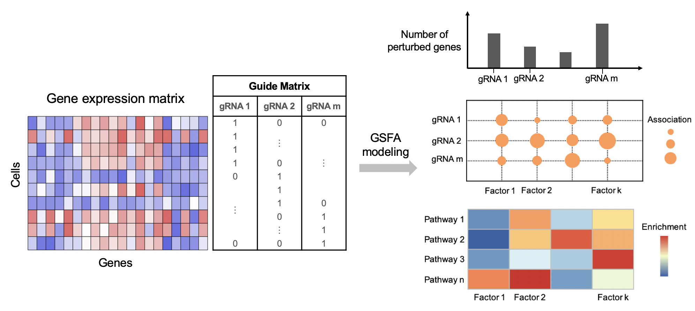

# GSFA: Bayesian sparse factor analysis on single-cell CRISPR screen data

Single-cell RNA-seq with multiplexed CRISPR screening (e.g. CROP-seq, Perturb-seq) 
is a powerful tool to study the transcriptomic effects of genetic perturbations, 
bringing insights into gene regulation. However, traditional analysis of these data 
poses various statistical and interpretation challenges.

`GSFA` (Guided Sparse Factor Analysis) is a Bayesian hierarchical model that performs 
factorization of the gene expression matrix with a sparse prior on the gene loading to factors. 
Importantly, the factors in a sample depend on the sample-level perturbations through 
a linear regression model with shrinkage, capturing the broad transcriptomic effects of 
perturbations. In this way, the inference of factors are, to some extent, 
guided by the given perturbations.

`GSFA` is particularly suited for single-cell CRISPR screening data. 
Provided with a normalized gene expression matrix and a gRNA design matrix, 
`GSFA` can identify coordinated factors (gene modules) and estimate their association with 
given genetic perturbations in a joint probabilistic framework. 
Differentially expressed genes under each gRNA perturbation can be detected 
by thresholding the local false sign rate (_lfsr_). The biological function 
of each factor (gene module) can be interpreted through gene ontology/pathway enrichment analysis 
on genes with nonzero weights in the factor.



## Installation

To install the development version of the `GSFA` package from this repository, run:

```R
install.packages("devtools")
devtools::install_github("gradonion/GSFA")
```

Note that installing the package will require a C++ compiler setup that is appropriate for the version of R installed on your computer.

## Using the package

For guidance on using GSFA to analyze single-cell CRISPR screen data, please see the tutorial 
[applying GSFA to LUHMES CROP-seq data](https://gradonion.github.io/GSFA_site/LUHMES_merged_new.gsfa_all_markers_detect_01.html).

## Credits

The GSFA package is developed by Yifan Zhou from the
[He Lab](http://xinhelab.org) at the University of Chicago.
